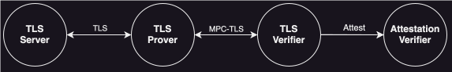

# Does TLSNotary produce "proofs" or "attestations"? 

Recently, we've seen an increasing use of the term "zkTLS" [TODO: add links to Twitter]. The "zk" prefix suggests a combination of TLS with zk-SNARKs (Zero-Knowledge Succinct Non-Interactive Argument of Knowledge), implying that the protocol would be publicly verifiable.

To avoid confusion, we want to explain how TLSNotary achieves verifiable TLS sessions. Spoiler: TLSNotary's output is not a publicly verifiable proof; it is an attestation.

[TODO embed https://x.com/sinu_eth/status/1827135565185401239 here]

Before we dive deeper into TLSNotary, let’s first recap TLS itself.

**TLS (Transport Layer Security)** is the protocol that underpins much of the secure communication on the internet. It is the “s” in https. TLS ensures that data sent between a client and server is encrypted and remains private. However, unless the data is cryptographically signed at the source, traditional TLS doesn’t offer a straightforward way to prove to a third party what data was exchanged.

**TLSNotary** is a tool designed to solve this problem by implementing an **MPC-TLS (Multi-Party Computation TLS)** protocol. In TLSNotary, two parties—a Prover and a Verifier—cooperate to establish a TLS connection and retrieve authenticated data from a server. Through this collaboration, both parties receive cryptographic guarantees about the data’s authenticity and integrity. On the server’s side, this looks like a normal TLS session. TLSNotary also protects the privacy of the Prover (aka the "user"), but that is beyond the scope of this blog post.

But what if a fourth or fifth party wants to verify the TLS session? They could repeat the process above to obtain their own cryptographic guarantees. However, in many cases, it’s more practical to delegate the TLS verification to a trusted party and rely on their attestations.

## Proofs vs. Attestations

When we talk about **proofs** in cryptography, we usually refer to something that is **publicly verifiable**—anyone with the proof can independently verify its validity without needing additional information. Publicly verifiable proofs are often associated with zk-SNARKs and allow anyone to verify the proof without needing to trust any specific party. These systems are highly desirable but unfortunately not always feasible.

**Designated verifier** systems delegate verification to one verifier (or a coordinated group of verifiers). After successful verification, a verifier can **attest** to the data for other parties by issuing a signed **attestation**. This approach requires trust in the designated verifier’s integrity.

In the case of MPC-TLS, the Verifier knows the TLS session was authentic, so it can attest to it. However, the result is not something that everyone can independently verify without trust in the Verifier.

**Remark:** In the TLSNotary source code, the lines between a proof and an attestation can seem confusing. While TLSNotary generates something that is a proof to the Verifier, to anyone else, it is an attestation.

## Onchain Attestations

The Verifier cannot operate onchain, as it must be online simultaneously with both the Prover and the Server. However, the TLSNotary result can still be utilized onchain if the Verifier signs the output as an attestation. This attestation, however, is not a publicly verifiable proof. Since a Verifier could potentially sign anything, consumers of this information must trust the Verifier. While TLSNotary can be used to build oracles, it does not solve the **oracle problem**.

## Conclusion

The term zkTLS is catchy and may sound appealing, but it’s important not to jump to conclusions. The "zk" prefix in zkTLS suggests public verifiability, which is not applicable to TLS. Therefore, it’s crucial to use the term "proof" cautiously in this context; in most cases, "attestation" is the more accurate term, especially when discussing the use of TLSNotary outputs onchain.