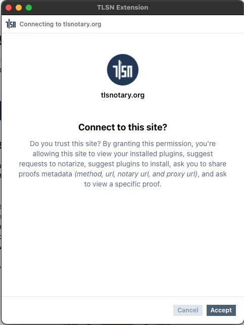
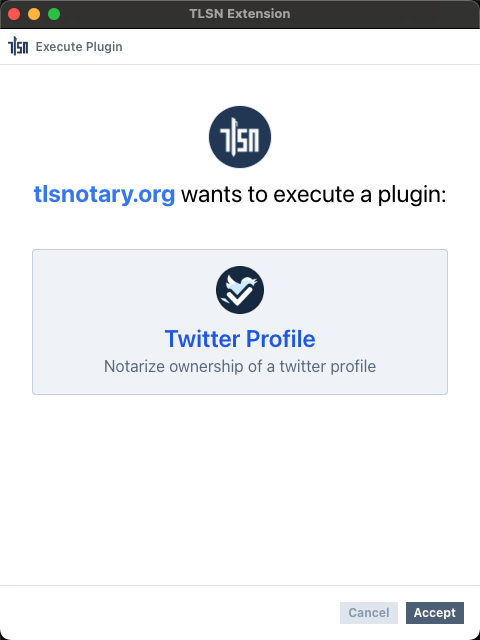

# TLSN Extension's Provider API

This page is a reference for the **TLSN Extension's Provider API**. This API can be used in web pages to execute plugins via the TLSN extension.

The TLSN Extension injects a provider API into websites visited by its users using the `window.tlsn` provider object. This allows webpages to **connect to the TLSN Extension** and execute plugins, with the user's permission.

## Connect to TLSN Extension

### `tlsn.connect()`

This method is used to request a connection between the website and the extension. Once connected, the website can use the provider API to request actions from the extension.

#### Parameters
None.

#### Returns
A promise that resolves to the full provider API object.

#### Example
```ts
const client = await tlsn.connect();
```

#### Screenshot



### `client.runPlugin(url, params)`

This method is used to request the execution of a plugin by its URL. If the plugin is not already installed, the extension will attempt to install it from the provided URL.


#### Parameters
1. `url`: The URL to the plugin's WASM file.
2. `params` *(optional)*: An object containing user input parameters as key-value pairs.

#### Returns
A promise that resolves to the proof data.
```ts
type ProofData = {
  notaryUrl: string;
  session: Session; // https://github.com/tlsnotary/tlsn-js/blob/main/src/types.ts#L7-L11;
  substrings: Substrings; // https://github.com/tlsnotary/tlsn-js/blob/main/src/types.ts#L73-L76
}
```

#### Example
```ts
const proof = await client.runPlugin(
  "https://github.com/tlsnotary/tlsn-extension/raw/main/plugins/twitter_profile/index.wasm",
  { Key: "Value" }
);
```

#### Screenshot

