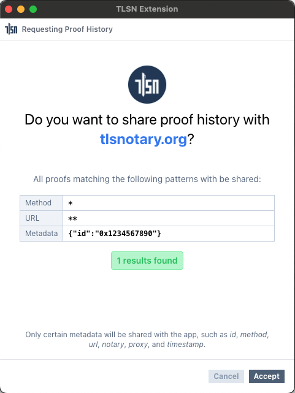
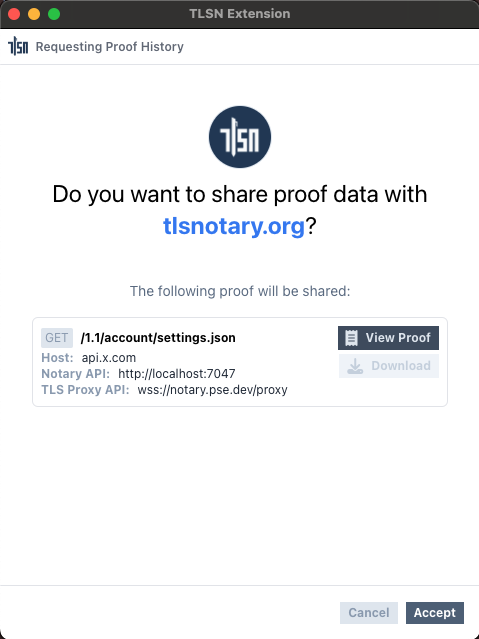
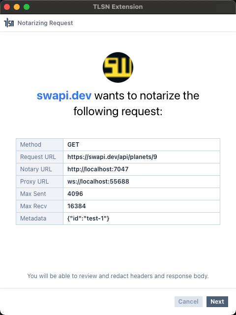
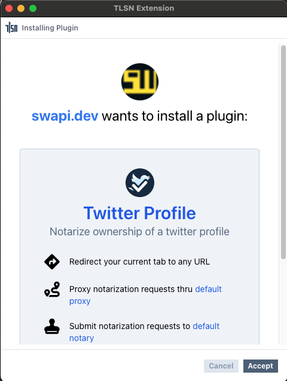
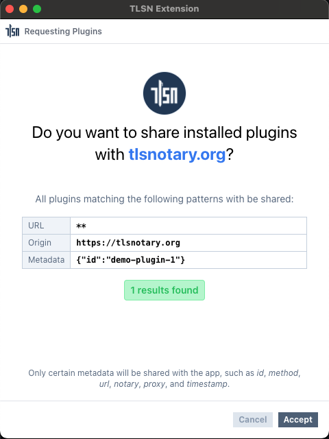

# TLSN Extension's Provider API

This page is a reference for the **TLSN Extension's Provider API**. This API can be used in web pages to request attestation history, notarize requests, manage plugins, and more from the TLSN extension.

The TLSN Extension injects a provider API into websites visited by its users using the `window.tlsn` provider object. This allows webpages to **connect to the TLSN Extension** and query TLSN attestations, with the user's permission, of course.

## Connect to TLSN Extension

### `tlsn.connect()`

This method is used to request a connection between the website and the extension. Once connected, the website can use the provider API to request actions from the extension.

#### Parameters
None.

#### Returns
A promise that resolves to the full provider API object.

#### Example
```ts
const client = await tlsn.connect();
```

#### Screenshot


## Provider API Methods

### `client.getHistory(method, url, metadata)`

This method is used to request attestation history from the extension.

#### Parameters
1. `method`: A glob pattern matching the request method of the proof. (e.g., `get`, `{get,post}`, `*`)
2. `url`: A glob pattern matching the request URL of the proof. (e.g., `**`, `https://swapi.dev/**`)
3. `metadata`: An object containing glob patterns that match metadata about the request. (e.g., `{id: "swapi-proof-1"}`)

#### Returns
A promise that resolves to an array of proof header data.
```ts
type ProofHeader = {
  id: string;
  method: string;
  notaryUrl: string;
  time: string;
  url: string;
  websocketProxyUrl: string;
}
```

#### Example
```ts
const proofs = await client.getHistory('*', '**', {id: '0x1234567890'});
```

#### Screenshot


### `client.getProof(id)`

This method is used to request the full data of a specific proof by its ID.

#### Parameters
1. `id`: The ID of the proof.

#### Returns
A promise that resolves to the proof data or `null`.
```ts
type ProofData = {
  notaryUrl: string;
  session: Session; // https://github.com/tlsnotary/tlsn-js/blob/main/src/types.ts#L7-L11;
  substrings: Substrings; // https://github.com/tlsnotary/tlsn-js/blob/main/src/types.ts#L73-L76
}
```

#### Example
```ts
const proof = await client.getProof('FE512M1.72007336176400000000000000000000');
```

#### Screenshot


### `client.notarize(url, requestOptions, proofConfig)`

This method is used to request notarization of a specific request.

#### Parameters
1. `url`: The URL of the request.
2. `requestOptions`: An object containing the following:
    1. `method`: `GET`, `POST`, `PUT`, etc.
    2. `headers`: A map of headers.
    3. `body`: The string content of the request body.
3. `proofConfig`: An object containing the following:
    1. `notaryUrl`: URL of the notary (defaults to the extension's setting).
    2. `websocketProxyUrl`: URL of the websocket proxy (defaults to the extension's setting).
    3. `maxSentData`: Maximum allowed sent data (defaults to the extension's setting).
    4. `maxRecvData`: Maximum allowed received data (defaults to the extension's setting).
    5. `maxTranscriptSize`: Maximum allowed transcript size (defaults to the extension's setting).
    6. `metadata`: An object containing metadata.

#### Returns
A promise that resolves to the proof data.
```ts
type ProofData = {
  notaryUrl: string;
  session: Session; // https://github.com/tlsnotary/tlsn-js/blob/main/src/types.ts#L7-L11;
  substrings: Substrings; // https://github.com/tlsnotary/tlsn-js/blob/main/src/types.ts#L73-L76
}
```

#### Example
```ts
const proof = await client.notarize(
  'https://swapi.dev/api/planets/9',
  {
    method: 'get',
    headers: {
      "Accept": "application/json",
      "Accept-Encoding": "identity",
      "Connection": "close",
      "Cookie": "csrftoken=blahblahblah",
    }
  },
  {
    metadata: {id: 'test-1'},
  }
);
```

#### Screenshot


### `client.installPlugin(url, metadata)`

This method is used to request the installation of a plugin.

#### Parameters
1. `url`: The URL to the plugin's WASM file.
2. `metadata`: An object containing metadata about the plugin.

#### Returns
A promise that resolves to the plugin ID.

#### Example
```ts
const pluginId = await client.installPlugin(
  'https://github.com/tlsnotary/tlsn-extension/raw/main/plugins/twitter_profile/index.wasm',
  { id: 'demo-plugin-1' }
);
```

#### Screenshot


### `client.getPlugins(url, origin, metadata)`

This method is used to query installed plugins.

#### Parameters
1. `url`: A glob pattern matching the URL to the plugin's WASM file.
2. `origin`: A glob pattern matching the origin requesting the plugin installation.
3. `metadata`: An object containing glob patterns matching metadata about the plugin.

#### Returns
A promise that resolves to the plugin configuration.

```ts
type PluginConfig = {
  hash: string;
  title: string;
  description: string;
  icon?: string;
  steps?: StepConfig[];
  hostFunctions?: string[];
  cookies?: string[];
  headers?: string[];
  localStorage?: string[];
  sessionStorage?: string[];
  requests: { method: string; url: string }[];
  notaryUrls?: string[];
  proxyUrls?: string[];
};
```

#### Example
```ts
const plugin = await client.getPlugins('**', 'https://swapi.dev', {id: 'demo-plugin-1'});
```

#### Screenshot


### `client.runPlugin(id, params)`

This method is used to request the execution of a plugin.

#### Parameters
1. `id`: The ID of the plugin.
2. `params` *(optional)*: An object containing user input parameters as key-value pairs.

#### Returns
A promise that resolves to the proof data.
```ts
type ProofData = {
  notaryUrl: string;
  session: Session; // https://github.com/tlsnotary/tlsn-js/blob/main/src/types.ts#L7-L11;
  substrings: Substrings; // https://github.com/tlsnotary/tlsn-js/blob/main/src/types.ts#L73-L76
}
```

#### Example
```ts
const plugin = await client.runPlugin(
  "6931d2ad63340d3a1fb1a5c1e3f4454c5a518164d6de5ad272e744832355ee02",
  { Key: "Value" }
);
```

#### Screenshot

