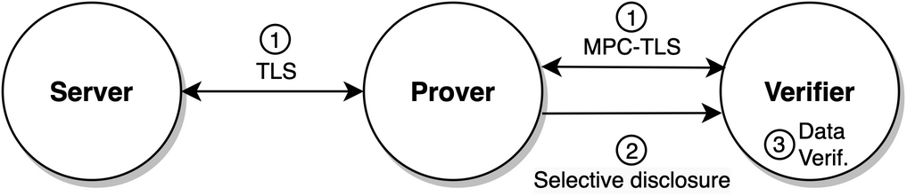
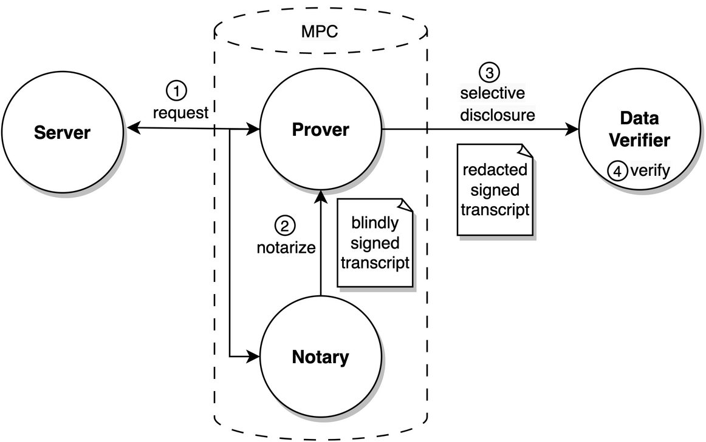

# Introduction

## Data Provenance without Compromising Privacy, That is Why!

The Internet currently lacks effective, privacy-preserving **Data Provenance**. [TLS](https://en.wikipedia.org/wiki/Transport_Layer_Security), also known as the "s" in "https" 🔐 to the general public, ensures that data can be securely communicated between a server and a user. But how can this user credibly share this data with another user or server without compromising security, privacy, and control?

Enter TLSNotary: a protocol enabling users to export data securely from any website. Using Zero Knowledge Proof (ZKP) technology, this data can be selectively shared with others in a cryptographically verifiable manner.

TLSNotary makes data truly portable and allows a user, the `Prover`, to share it with another party, the `Verifier`, as they see fit.

## How Does the TLSNotary Protocol Work?

The TLSNotary protocol consists of 3 steps:
1. The `Prover` **requests** data from a `Server` over TLS while cooperating with the `Verifier` in secure and privacy-preserving *multi-party computation (MPC)*.
2. The `Prover` **selectively discloses** the data to the `Verifier`.
3. The `Verifier` **verifies** the data.

### ① Multi-party TLS Request

TLSNotary works by adding a third party, a `Verifier`, to the usual TLS connection between the `Prover` and a `Server`. This `Verifier` is **not "[a man in the middle](https://en.wikipedia.org/wiki/Man-in-the-middle_attack)"**. Instead, the `Verifier` participates in a **secure multi-party computation** (MPC) to jointly operate the TLS connection without seeing the data in plain text. By participating in the MPC, the `Verifier` can validate the authenticity and integrity of the data the `Prover` received from the `Server`.

The TLSNotary protocol is transparent to the `Server`. From the `Server`'s perspective, the `Prover`'s connection is a standard TLS connection.

### ② Selective Disclosure

The TLSNotary protocol enables the `Prover` to selectively prove the authenticity of arbitrary parts of the data to a `Verifier`. In this **selective disclosure** phase, the `Prover` can **redact** sensitive information from the data prior to sharing it with the `Verifier`.

This capability can be paired with Zero-Knowledge Proofs to prove properties of the redacted data without revealing the data itself.

### ③ Data Verification

The `Verifier` now validates the proof received from the `Prover`. The data origin can be verified by inspecting the `Server` certificate through trusted certificate authorities (CAs). The `Verifier` can now make assertions about the non-redacted content of the transcript.

## TLS verification with a general-purpose Notary

Since the validation of the TLS traffic neither reveals anything about the plaintext of the TLS session nor about the `Server`, it is possible to outsource the MPC-TLS verification to a general-purpose TLS verifier ①, which we term a `Notary`. This `Notary` can sign (aka *notarize*) ② the data, making it portable. The `Prover` can then take this signed data and selectively disclose ③ sections to an application-specific `Data verifier`, who then verifies the data ④.

In this setup, the `Notary` cryptographically signs commitments to the data and the server's identity. The `Prover` can store this signed data, redact it, and share it with any `Data Verifier` as they see fit, making the signed data both reusable and portable.

`Data Verifiers` will only accept the signed data if they trust the `Notary`. A `Data Verifier` can also require signed data from multiple `Notaries` to rule out collusion between the `Prover` and a `Notary`.

## What Can TLSNotary Do?

TLSNotary can be used for various purposes. For example, you can use TLSNotary to prove that:
- you have access to an account on a web platform
- a website showed specific content on a certain date
- you have private information about yourself (address, birth date, health, etc.)
- you have received a money transfer using your online banking account without revealing your login credentials or sensitive financial information
- you received a private message from someone
- you purchased an item online
- you were blocked from using an app
- you earned professional certificates

While TLSNotary can notarize publicly available data, it does not solve the "[oracle problem](https://ethereum.org/en/developers/docs/oracles/)". For this use case, existing oracle solutions are more suitable.

## Who is behind TLSNotary?

TLSNotary is developed by the [Privacy and Scaling Exploration (PSE)](https://pse.dev) research lab of the Ethereum Foundation. The PSE team is committed to conceptualizing and testing use cases for cryptographic primitives.

TLSNotary is not a new project; in fact, it has been around for [more than a decade](https://bitcointalk.org/index.php?topic=173220.0).

In 2022, TLSNotary was rebuilt from the ground up in [Rust](https://www.rust-lang.org/) incorporating state-of-the-art cryptographic protocols. This renewed version of the TLSNotary protocol offers enhanced security, privacy, and performance.

Older versions of TLSNotary, including PageSigner, have been archived due to a security vulnerability.
