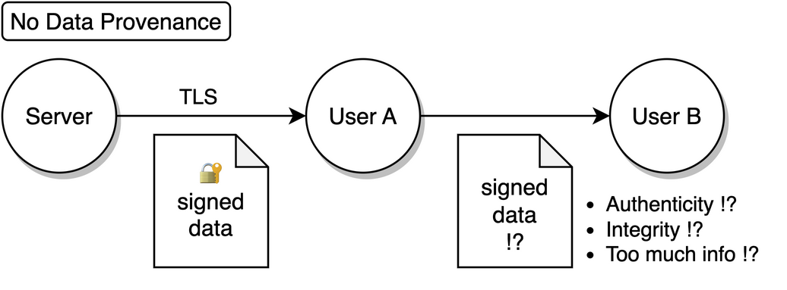

# Motivation

The decentralized internet demands privacy-respecting data provenance!

Data provenance ensures internet data is authentic. It allows verification of the data's origin, ensuring it hasn't been fabricated or tampered with.

Data provenance will make data truly portable, empowering users to share it with others as they see fit.

## Non-repudiation: TLS is not enough

Transport Layer Security (TLS) plays a crucial role in digital security. TLS protects communication against eavesdropping and tampering. It ensures that the data received by the `User` indeed originated from the `Server` and was not changed. The `Server`'s identity is verified by the `User` through trusted Certificate Authorities (CAs). Data integrity is maintained by transmitting a cryptographic hash (called Message Authentication Code or MAC in TLS) alongside the data, which safeguards against deliberate alterations.

However, this hash does not provide **non-repudiation**, meaning it cannot serve as evidence for the **authenticity and integrity** of the data to third parties (e.g., a service or an app). Because it is a keyed hash and TLS requires that the key is known to the `User`, the `User` could potentially modify the data and compute a corresponding hash after the TLS session is finished.

Achieving non-repudiation requires digital signatures implemented with asymmetric, public-key cryptography.

While the concept seems straightforward, enabling servers to sign data is not a part of the TLS protocol. Even if all data were securely signed, naively sharing all data with others could expose too much information, compromising the `User`'s privacy. **Privacy** is a vital social good that must be protected.

## Status Quo: delegate access

Currently, when a `User` wants to share data from a `Server` with another party, OAuth can be used to facilitate this if the application supports it. In this way, the other party receives the data directly from the `Server`, ensuring authentic and unchanged data. However, applications often do not provide fine-grained control over which data to share, leading to the other party gaining access to more information than strictly necessary.

Another drawback of this solution is that the `Server` is aware of the access delegation, enabling it to monitor and censor the other user’s requests.

It's worth noting that in many instances, OAuth is not even presented as an option. This is because a lot of servers lack the incentive to provide third-party access to the data.

## TLSNotary: data provenance and privacy with secure multi-party computation

TLSNotary operates by introducing a third party, the `Notary`, into the usual TLS connection between the `User` and a `Server`. This `Notary` is **not an intermediary**. Instead, the `Notary` participates in a **secure multi-party computation** (MPC) to jointly manage the TLS connection without ever viewing the data in plain text; the `Notary` only has access to encrypted data. Furthermore, as the `Notary` only possesses the ephemeral keys of the `Server`, it remains unaware of which `Server` the `User` is communicating with.

The TLSNotary protocol is **transparent** to the `Server`. From the `Server`'s perspective, the TLS connection is indistinguishable from all other connections. As such, **no modifications to the TLS protocol are necessary**.

The TLSNotary protocol enables the `User` to selectively prove the authenticity of arbitrary portions of the data to a `Verifier` as long as the `Verifier` trusts the `Notary` who signed the data.

## Make your data portable with TLSNotary!

TLSNotary is a solution designed to prove the authenticity of data while preserving user privacy. It unlocks a variety of new use cases. So, if you're looking for a way to make your data portable without compromising on privacy, TLSNotary is developed for you!

Dive into the protocol and integrate it into your applications. We eagerly await your feedback on [Discord](https://discord.com/invite/9XwESXtcN7).
