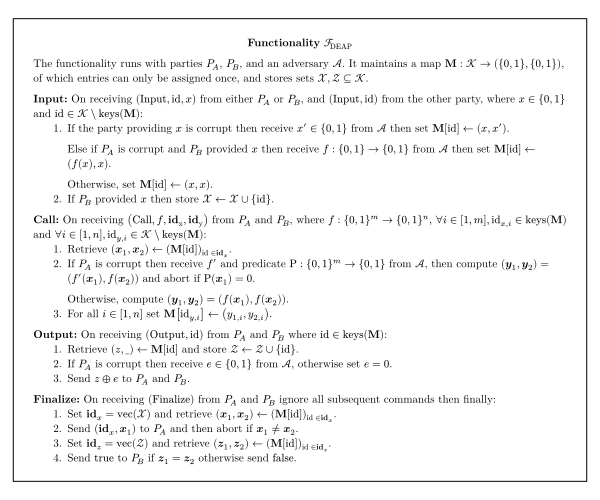

# Binary Arithmetic

TLS includes cryptographic algorithms which are most efficiently computed over the binary field such as the SHA-256 and AES-128 block ciphers.

Computing such algorithms using MPC can be quite expensive even when employing state-of-the-art protocols. To achieve practical efficiency TLSNotary leverages Dual Execution with Asymmetric Privacy (DEAP) as defined by the $\mathcal{F}_{\text{DEAP}}$ functionality presented below. This functionality is weaker than a perfectly secure functionality and thus can be efficiently realized using existing performant protocols such as garbled circuits in conjunction with a zero-knowledge protocol.

## Introduction

Malicious secure MPC typically comes at the expense of dramatically lower efficiency compared to the semi-honest setting. One technique, called Dual Execution [\[MF06\]](https://www.iacr.org/archive/pkc2006/39580468/39580468.pdf) [\[HKE12\]](https://www.cs.umd.edu/~jkatz/papers/SP12.pdf), achieves malicious security with a minimal 2x overhead. However, it comes with the concession that a malicious adversary may learn $k$ bits of the other's input with probability $2^{-k}$ of the leakage going undetected.

We present a variant of Dual Execution with a weaker security notion in favor of performance, while still satisfying the rather niche security requirements for TLSNotary. Our variant ensures perfect privacy _for one party_, by sacrificing privacy entirely for the other. Hence the name, Dual Execution with Asymmetric Privacy (DEAP). This is a distinct notion from zero-knowledge where only one party provides private inputs. In DEAP both parties can provide private inputs until the finalization procedure.

## Dual Execution with Asymmetric Privacy

Figure 1 defines a functionality $\mathcal{F}_{\text{DEAP}}$ which runs between parties $P_A$ and $P_B$, and an adversary $\mathcal{A}$. The functionality provides an interface akin to a virtual machine, including persistent memory and the ability to execute arbitrary boolean functions.

<table>
 <tr><td></td></tr>
 <tr><td>Figure 1: Functionality $\mathcal{F}_{\text{DEAP}}$</td></tr>
</table>

For $P_A$ the functionality provides perfect security with aborts, while $P_B$ receives significantly weaker guarantees.

The adversary is assumed to only corrupt one of the parties, and upon doing so is granted a number of affordances. Despite these affordances, $\mathcal{F}_{\text{DEAP}}$ maintains some key properties.

### Privacy

The functionality provides perfect privacy for the inputs of $P_A$ in the presence of a corrupted $P_B$. Upon corrupting $P_B$ the adversary can at most provide inconsistent inputs in the **Input** procedure. However, $\mathcal{A}$ can not learn any information about $P_A$ inputs as the functionality enforces consistency during the **Finalize** routine prior to performing an equality check on output values.

If $P_A$ is corrupted the inputs of $P_B$ are vulnerable to selective failure attacks by $\mathcal{A}$ prior to calling **Finalize**. The adversary may sample information about inputs provided by $P_B$ during the **Call** procedure using an arbitrary predicate $\text{P}$ at risk of causing an abort. In other words, for every **Call** invocation, $\mathcal{A}$ may sample $k$ input bits provided by $P_B$ with probability $2^{-k}$ of this leakage going undetected.

### Correctness

A key security notion to consider is that of _correctness_, which, loosely speaking, is whether upon receiving a function $f$ in the **Call** routine the functionality correctly computes $f$ and not some alternate function $f'$.

The functionality provides correctness to $P_A$ in the presence of a corrupted $P_B$. As mentioned earlier, the adversary may only replace the inputs of $P_B$ which is of no consequence regarding correctness.

$P_B$ does not enjoy the same notion of correctness if $P_A$ is corrupted. Rather, the adversary is permitted to provide an _arbitrary_ alternate function $f'$ in the **Call** procedure in addition to flipping output values in invocations of **Output**. It is in the **Finalize** procedure that $P_B$ can detect corruptions introduced by $\mathcal{A}$.

### Finalization

The **Finalize** procedure reveals all inputs provided by $P_B$ to $P_A$ and ensures that the adversary $\mathcal{A}$ can not learn any information of $P_A$ inputs by providing inconsistent inputs used in **Call**.

For example, if $P_B$ is corrupted and the adversary causes the input vectors $\bold{\mathbb{x}}_1$ and $\bold{\mathbb{x}}_2$ in **Call** to be inconsistent by exploiting the **Input** procedure, $\mathcal{A}$ could learn if $f(\bold{\mathbb{x}}_1) = f(\bold{\mathbb{x}}_2)$ in Step 4 of **Finalize**. Aborting beforehand if the inputs are inconsistent mitigates this possibility.

As mentioned [earlier](#correctness), $P_B$ is not provided any correctness guarantees in the presence of a corrupted $P_A$ prior to finalization. In leau of that, $P_B$ learns if any _output values_ are inconsistent via an equality check in Step 4. This significantly constrains the adversary while choosing alternate functions in **Call**. To illustrate this consider the following:

Suppose an honest $P_B$ expects to compute the function $f(x, y)$ where $x$ and $y$ are inputs provided by $P_A$ and $P_B$ respectively. Recall that an adversary corrupting $P_A$ may provide inconsistent input values $x_1$ and $x_2$ and an alternate function $f'$:

$$z_1 = f'(x_1, y)$$
$$z_2 = f(x_2, y)$$

In the extreme case, $\mathcal{A}$ may choose $f'$ such that it simply outputs $y$ and thus learning the input of $P_B$ directly. Indeed this is allowed, however such a corruption will be detected in Step 4 of **Finalize** which notifies $P_B$ if $z_1 \neq z_2$. Given that $\mathcal{A}$ must choose $x_1$, $x_2$ and $f'$ prior to learning the output, for the adversary to avoid detection they must satisfy all constraints on $y$ a priori. Put simply, the adversary may guess $k$ bits of $y$ with probability $2^{-k}$ of it going undetected.

To summarize the above, the finalization procedure ensures a probabilistic leakage bound on the inputs of $P_B$ and also enforces correctness albeit with potentially inconsistent inputs from $P_A$.

## Usage in TLSNotary

TLSNotary uses $\mathcal{F}_{\text{DEAP}}$ such that the `Prover` and `Verifier` are $P_A$ and $P_B$ respectively. This ensures that a corrupted `Verifier` can not extract any private information of the `Prover` nor can it affect the correctness of any of the computations which could lead to malicious state updates in an application. Conversely, a corrupted `Prover` can not prematurely learn the inputs of the `Verifier` nor break correctness in any meaningful way without detection.
