# Commitments

Here we illustrate the commitment scheme used to create authenticated commitments to the plaintext in scenarios where a general-purpose [`Notary`](../intro.md#tls-verification-with-a-general-purpose-notary) is used. (Note that this scheme is not used when the `Prover` proves directly to the `Verifier`)

A naive approach of extending the [`Encryption and Decryption`](../protocol/mpc-tls/encryption.md) steps to also compute a commitment (e.g. BLAKE3 hash) using MPC is too resource-intensive, prompting us to provide a more lightweight commitment scheme.

The high-level idea is that the `Prover` creates a commitment to the active plaintext encoding from the MPC protocol used for [`Encryption and Decryption`](../protocol/mpc-tls/encryption.md).

We also hide the amount of commitments (to preserve `Prover` privacy) by having the `Prover` commit to the Merkle tree of commitments.

