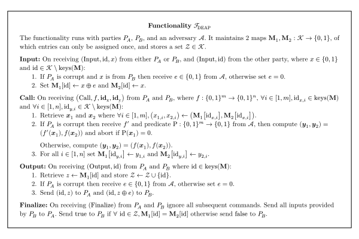

# Dual Execution with Asymmetric Privacy

TLSNotary uses the `DEAP` protocol described below to ensure malicious security of the overall protocol.

When using DEAP in TLSNotary, the `User` plays the role of Alice and has full privacy and the `Notary` plays the role of Bob and reveals all of his private inputs after the TLS session with the server is over. The Notary's private input is his TLS session key share.

The parties run the `Setup` and `Execution` steps of `DEAP` but they defer the `Equality Check`.
Since during the `Equality Check` all of the `Notary`'s secrets are revealed to User, it must be deferred until after the TLS session with the server is over, otherwise the User would learn the full TLS session keys and be able to forge the TLS transcript.

## Introduction

Malicious secure 2-party computation with garbled circuits typically comes at the expense of dramatically lower efficiency compared to execution in the semi-honest model. One technique, called Dual Execution [\[MF06\]](https://www.iacr.org/archive/pkc2006/39580468/39580468.pdf) [\[HKE12\]](https://www.cs.umd.edu/~jkatz/papers/SP12.pdf), achieves malicious security with a minimal 2x overhead. However, it comes with the concession that a malicious adversary may learn $k$ bits of the other's input with probability $2^{-k}$.

We present a variant of Dual Execution which provides different trade-offs. Our variant ensures complete privacy _for one party_, by sacrificing privacy entirely for the other. Hence the name, Dual Execution with Asymmetric Privacy (DEAP). During the execution phase of the protocol both parties have private inputs. The party with complete privacy learns the authentic output prior to the final stage of the protocol. In the final stage, prior to the equality check, one party reveals their private input. This allows a series of consistency checks to be performed which guarantees that the equality check can not cause leakage.

Similarly to standard DualEx, our variant ensures output correctness and detects leakage (of the revealing parties input) with probability $1 - 2^{-k}$ where $k$ is the number of bits leaked.

## Preliminary

The protocol takes place between Alice and Bob who want to compute $f(x, y)$ where $x$ and $y$ are Alice and Bob's inputs respectively. The privacy of Alice's input is ensured, while Bob's input will be revealed in the final steps of the protocol.

### Premature Leakage

Firstly, our protocol assumes a small amount of premature leakage of Bob's input is tolerable. By premature, we mean prior to the phase where Bob is expected to reveal his input.

If Alice is malicious, she has the opportunity to prematurely leak $k$ bits of Bob's input with $2^{-k}$ probability of it going undetected.

### Aborts

We assume that it is acceptable for either party to cause the protocol to abort at any time, with the condition that no information of Alice's inputs are leaked from doing so.

## Functionality

## Analysis

### Malicious Alice

[On the Leakage of Corrupted Garbled Circuits \[DPB18\]](https://eprint.iacr.org/2018/743.pdf) is recommended reading on this topic.

During the first execution, Alice has some degrees of freedom in how she garbles $G_A$. According to \[DPB18\], when using a modern garbling scheme such as \[ZRE15\], these corruptions can be analyzed as two distinct classes: detectable and undetectable.

Recall that our scheme assumes Bob's input is an ephemeral secret which can be revealed at the end. For this reason, we are entirely unconcerned about the detectable variety. Simply providing Bob with the output labels commitment $\mathsf{com}_{[V]_A}$ is sufficient to detect these types of corruptions. In this context, our primary concern is regarding the _correctness_ of the output of $G_A$.

\[DPB18\] shows that any undetectable corruption made to $G_A$ is constrained to the arbitrary insertion or removal of NOT gates in the circuit, such that $G_A$ computes $f_A$ instead of $f$. Note that any corruption of $d_A$ has an equivalent effect. \[DPB18\] also shows that Alice's ability to exploit this is constrained by the topology of the circuit.

Recall that in the final stage of our protocol Bob checks that the output of $G_A$ matches the output of $G_B$, or more specifically:

$$f_A(x_1, y_1) == f_B(x_2, y_2)$$

For the moment we'll assume Bob garbles honestly and provides the same inputs for both evaluations.

$$f_A(x_1, y) == f(x_2, y)$$

In the scenario where Bob reveals the output of $f_A(x_1, y)$ prior to Alice committing to $x_2$ there is a trivial _adaptive attack_ available to Alice. As an extreme example, assume Alice could choose $f_A$ such that $f_A(x_1, y) = y$. For most practical functions this is not possible to garble without detection, but for the sake of illustration we humor the possibility. In this case she could simply compute $x_2$ where $f(x_2, y) = y$ in order to pass the equality check.

To address this, Alice is forced to choose $f_A$, $x_1$ and $x_2$ prior to Bob revealing the output. In this case it is obvious that any _valid_ combination of $(f_A, x_1, x_2)$ must satisfy all constraints on $y$. Thus, for any non-trivial $f$, choosing a valid combination would be equivalent to guessing $y$ correctly. In which case, any attack would be detected by the equality check with probability $1 - 2^{-k}$ where k is the number of guessed bits of $y$. This result is acceptable within our model as [explained earlier](#premature-leakage).

### Malicious Bob

[Zero-Knowledge Using Garbled Circuits \[JKO13\]](https://eprint.iacr.org/2013/073.pdf) is recommended reading on this topic.

The last stage of our variant is functionally equivalent to the protocol described in \[JKO13\]. After Alice evaluates $G_B$ and commits to $[v]_B$, Bob opens his garbled circuit and all OTs entirely. Following this, Alice performs a series of consistency checks to detect any malicious behavior. These consistency checks do _not_ depend on any of Alice's inputs, so any attempted selective failure attack by Bob would be futile.

Bob's only options are to behave honestly, or cause Alice to abort without leaking any information.

### Malicious Alice & Bob

They deserve whatever they get.
