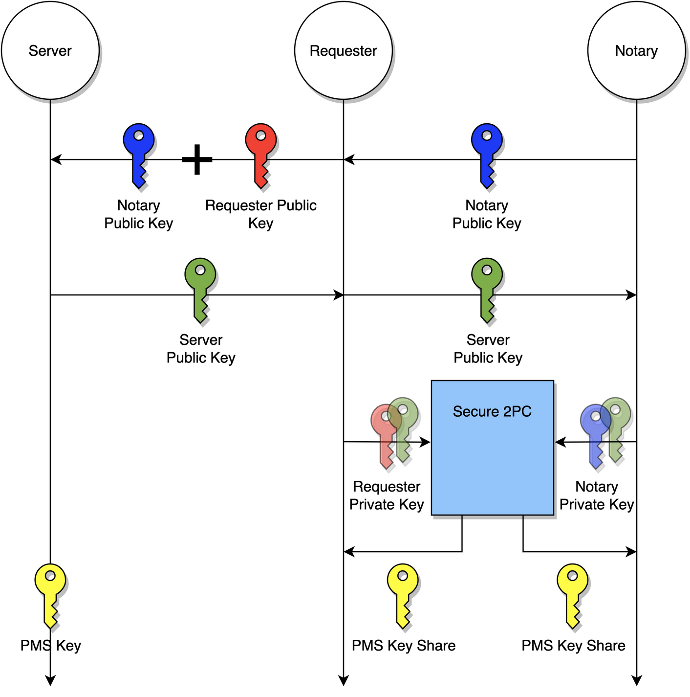

# Key Exchange

In TLS, the first step towards obtaining TLS session keys is to compute a shared secret between the client and the server by running the [ECDH protocol](https://en.wikipedia.org/wiki/Elliptic-curve_Diffie–Hellman). The resulting shared secret in TLS terms is called the pre-master secret.

## ECDH

We will denote:

- $P$ as the `Prover`
- $V$ as the `Verifier`
- $S$ as the `Server`
- $\mathbb{pms}$ as the TLS pre-master secret.

Below is the 3-party ECDH protocol between $S$, $P$ and $V$, enabling $P$ and $V$ to arrive at shares of $\mathbb{pms}$.

1. $S$ sends its public key $Q_b$ to $P$, and $P$ forwards it to $V$
2. $P$ picks a random private key share $d_c$ and computes a public key share $Q_c = d_c * G$
3. $V$ picks a random private key share $d_n$ and computes a public key share $Q_n = d_n * G$
4. $V$ sends $Q_n$ to $P$ who computes $Q_a = Q_c + Q_n $ and sends $Q_a$ to $S$
5. $P$ computes an EC point $(x_p, y_p) = d_c * Q_b$
6. $V$ computes an EC point $(x_q, y_q) = d_n * Q_b$

Now our goal is to compute additive shares of $\mathbb{pms}$, which we'll redenote as $x_r$, using elliptic curve point addition

$$ x_r = (\frac{y_q-y_p}{x_q-x_p})^2 - x_p - x_q $$

in such a way that

- Neither party learns the other party's share.
- Neither party learns $x_r$, only their respective shares of $x_r$.

To do this we will need two functionalities defined below:

### A2M

$\mathsf{A2M}$ converts additive shares into multiplicative shares.

For example, given additive shares $a$ and $b$ such that $a + b = c$, invoking $\mathsf{A2M}$ gives $(d, e) \larr (a, b)_{\mathsf{A2M}}$ such that $d * e = c$

### M2A

$\mathsf{M2A}$, which converts multiplicative shares into additive shares.

For example, given multiplicative shares $d$ and $e$ such that $d * e = c$, invoking $\mathsf{M2A}$ gives $(a, b) \larr (d, e)_{\mathsf{M2A}}$ such that $a + b = c$

### Deriving additive shares of the pre-master secret

We apply $\mathsf{A2M}$ to $y_q + (-y_p)$ to get $A_q * A_p$ and also we apply $\mathsf{A2M}$ to $x_q + (-x_p)$ to get $B_q * B_p$. Then the above can be rewritten as:

$$x_r = (\frac{A_q}{B_q})^2 * (\frac{A_p}{B_p})^2 - x_p - x_q $$

Then the first party locally computes the first factor and gets $C_q$, the second party locally computes the second factor and gets $C_p$. Then we can again rewrite as:

$$x_r = C_q * C_p - x_p - x_q $$

Now we apply $\mathsf{M2A}$ to $C_q * C_p$ to get $D_q + D_p$, which leads us to two final terms each of which is the share of $x_r$ of the respective party: 

$$x_r = (D_q - x_q) + (D_p - x_p)$$

Now each party holds their respective additive shares of the TLS pre-master secret.