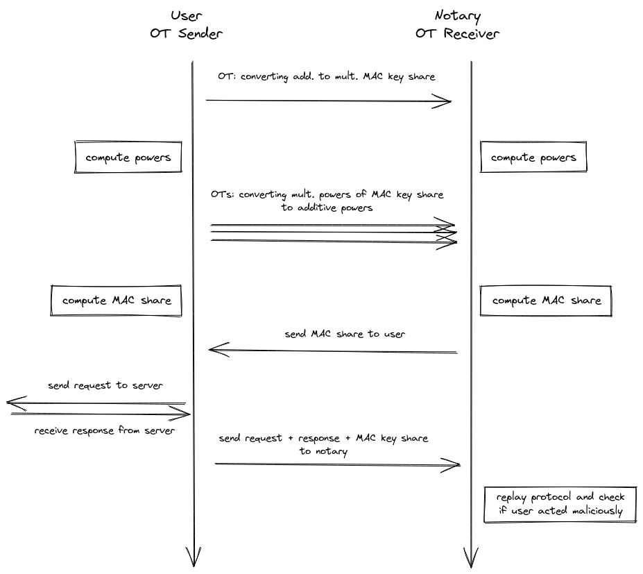

# Computing MAC in 2PC

1. [What is a MAC](#section1)
2. [How a MAC is computed in AES-GCM](#section2)
3. [Computing MAC using secure two-party computation (2PC)](#section3) 


## 1. What is a MAC <a name="section1"></a>

When sending an encrypted ciphertext to the Webserver, the User attaches a
checksum to it. The Webserver uses this checksum to check whether the ciphertext
has been tampered with while in transit. This checksum is known as the
"authentication tag" and also as the "Message Authentication Code" (MAC).

In order to create a MAC for some ciphertext not only the ciphertext but also
some secret key is used as an input. This makes it impossible to forge some
ciphertext without knowing the secret key.

The first few paragraphs of [this article](https://zsecurity.org/bit-flipping-attacks-against-cipher-block-chaining-algorithms/)
explain what would happen if there was no MAC: it would be possible for a
malicious actor to modify the **plaintext** by flipping certain bits of the
**ciphertext**.


## 2. How a MAC is computed in AES-GCM <a name="section2"></a>

In TLS the plaintext is split up into chunks called "TLS records". Each TLS
record is encrypted and a MAC is computed for the ciphertext. The MAC (in
AES-GCM) is obtained by XORing together the `GHASH output` and the `GCTR
output`. Let's see how each of those outputs is computed:

### 2.1 GCTR output 

The `GCTR output` is computed by simply AES-ECB encrypting a counter block with
the counter set to 1 (the iv, nonce and AES key are the same as for the rest of
the TLS record).  

### 2.2 GHASH output

The `GHASH output` is the output of the GHASH function described in the
[NIST publication](https://nvlpubs.nist.gov/nistpubs/legacy/sp/nistspecialpublication800-38d.pdf)
in section 6.4 in this way: "In effect, the GHASH function calculates $
X_1•H^{m} ⊕ X_2•H^{m−1} ⊕ ... ⊕ X_{m−1}•H^{2} ⊕ X_m•H$". $H$
and $X$ are elements of the extension field $\mathrm{GF}(2^{128})$.

* "•" is a special type of multiplication called `multiplication in a finite
field` described in section 6.3 of the NIST publication.
* ⊕ is `addition in a finite field` and it is defined as XOR.

In other words, GHASH splits up the ciphertext into 16-byte blocks, each block
is numbered $X_1, X_2, ...$ etc. There's also $H$
which is called the `GHASH key`, which just is the AES-encrypted zero-block. We
need to raise $H$ to as many powers as there are blocks, i.e. if
we have 5 blocks then we need 5 powers: $H, H^2, H^3, H^4, H^5$.
Each block is multiplied by the corresponding power and all products are summed
together.

Below is the pseudocode for multiplying two 128-bit field elements `x` and `y`
in $\mathrm{GF}(2^{128})$:

```
1. result = 0
2. R = 0xE1000000000000000000000000000000
3. bit_length = 128
4. for i=0 upto bit_length-1
5.    if y[i] == 1
6.       result ^= x
7. x = (x >> 1) ^ ((x & 1) * R)
8. return result
```

Standard math properties hold in finite field math, viz. commutative: $a+b=b+a$
and distributive: $a(b+c)=ab+ac$.


## 3. Computing MAC using secure two-party computation (2PC) <a name="section3"></a>

The goal of the protocol is to compute the MAC in such a way that neither party
would learn the other party's share of $H$ i.e. the `GHASH key`
share. At the start of the protocol each party has:
1. ciphertext blocks $X_1, X_2, ..., X_m$.
2. XOR share of $H$: the `User` has $H_u$
   and the `Notary` has $H_n$.
3. XOR share of the `GCTR output`: the `User` has $GCTR_u$
   and the `Notary` has $GCTR_n$.

Note that **2.** and **3.** were obtained at an earlier stage of the TLSNotary protocol.

### 3.1 Example with a single ciphertext block

To illustrate what we want to achieve, we consider the case of just having
a single ciphertext block $X_1$. The `GHASH_output` will be:

$X_1•H = X_1•(H_u ⊕ H_n) = X_1•H_u ⊕ X_1•H_n$

The `User` and the `Notary` will compute locally the left and the right terms
respectively. Then each party will XOR their result to the `GCTR output` share
and will get their XOR share of the MAC:

`User`  : $X_1 • H_u \quad ⊕ \quad GCTR_u = MAC_u$

`Notary`: $X_1 • H_n \quad ⊕ \quad GCTR_n = MAC_n$

Finally, the `Notary` sends $ MAC_n$ to the `User` who obtains: 

$MAC = MAC_n \quad ⊕ \quad MAC_u$

**For longer ciphertexts, the problem is that higher powers of the hashkey
$H^k$ cannot be computed locally, because we deal with additive sharings,
i.e.$ (H_u)^k ⊕ (H_n)^k \neq H^k$.** 

### 3.2 Computing ciphertexts with an arbitrary number of blocks
We now introduce our 2PC MAC protocol for computing ciphertexts with an
arbitrary number of blocks. Our protocol can be divided into the following
steps.

##### Steps

1. First, both parties convert their **additive** shares $H_u$ and $H_n$ into
   **multiplicative** shares $\overline{H}_u$ and $\overline{H}_n$.
2. This allows each party to **locally** compute the needed higher powers of these multiplicative
   shares, i.e for $m$ blocks of ciphertext:
   - the user computes $\overline{H_u}^2, \overline{H_u}^3, ... \overline{H_u}^m$ 
   - the notary computes $\overline{H_n}^2, \overline{H_n}^3, ... \overline{H_n}^m$ 
3. Then both parties convert each of these multiplicative shares back to additive shares
   - the user ends up with $H_u, H_u^2, ... H_u^m$ 
   - the notary ends up with $H_n, H_n^2, ... H_n^m$ 
4. Each party can now **locally** compute their additive MAC share $MAC_{n/u}$.

The conversion steps (**1** and **3**) require communication between the user
and the notary. They will use **A2M** (Addition-to-Multiplication) and **M2A**
(Multiplication-to-Addition) protocols, which make use of **oblivious
transfer**, to convert the shares. **The user will be the sender and the notary
the receiver.**



#### 3.2.1 (A2M) Convert additive shares of H into multiplicative share

At first (step **1**) we have to get a multiplicative share of $H_{n/u}$,
so that notary and user can locally compute the needed higher powers. For this
we use an adapted version of the A2M protocol in chapter 4 of [Efficient Secure
Two-Party Exponentiation](https://www.cs.umd.edu/~fenghao/paper/modexp.pdf).

The user will decompose his share into $i$ individual oblivious transfers
$t_{u, i}^k = R \cdot (k \cdot 2^i + H_{u, i} \cdot 2^i ⊕ s_i)$, where
- $R$ is some random value used for all oblivious transfers
- $s_i$ is a random mask used per oblivious transfer, with $\sum_i s_i = 0$
- $k \in \\{0, 1\\}$ depending on the receiver's choice.

The notary's choice in the i-th OT will depend on the bit value in the i-th
position of his additive share $H_n$. In the end the multiplicative share of
the user $\overline{H_u}$ will simply be the inverse $R^{-1}$ of the
random value, and the notary will sum all his OT outputs, so that all the
$s_i$ will vanish and hence he gets his multiplicative share
$\overline{H_n}$.

$$
\begin{align}
H &= H_u ⊕ H_n \\\\
&= R^{-1} \cdot R \cdot \sum_i (H_{u,i} ⊕ H_{n, i}) \cdot 2^i ⊕ s_i \\\\
&= R^{-1} \cdot \sum_i t_{u, i}^{H_{n, i}} ⊕ R \cdot \sum_i s_i \\\\
&= \overline{H_u} \cdot \overline{H_n}
\end{align}
$$


#### 3.2.2 (M2A) Convert multiplicative shares $\overline{H^k}$ into additive shares

In step **3** of our protocol, we use the oblivious transfer method described
in chapter 4.1 of the Gilboa paper [Two Party RSA Key
Generation](https://link.springer.com/content/pdf/10.1007/3-540-48405-1_8.pdf)
to convert all the multiplicative shares $\overline{H_{n/u}^k}$ back into
additive shares $H_{n/u}^k$. We only show how the method works for the share
$\overline{H_{n/u}^1}$, because it is the same for higher powers.

The user will be the OT sender and decompose his shares into $i$ individual
oblivious transfers $t_{u,i}^k = k \cdot \overline{H_u} \cdot 2^i + s_i$,
where $k \in \\{0, 1\\}$, depending on the receiver's choices. Each of these
OTs is masked with a random value $s_i$. He will then obliviously send them to
the notary. Depending on the binary representation of his multiplicative share,
the notary will choose one of the choices and do this for all 128 oblivious
transfers.

After that the user will locally XOR all his $s_i$ and end up with his additive
share $H_u$, and the notary will do the same for all the results of the
oblivious transfers and get $H_n$.

$$
\begin{aligned}
\overline{H} &= \overline{H_u} \cdot \overline{H_n} \\\\
&= \overline{H_u} \cdot \sum_i \overline{H_{n, i}} \cdot 2^i \\\\
&= \sum_i (\overline{H_{n, i}} \cdot \overline{H_u} \cdot 2^i ⊕ s_i) ⊕ \sum_i s_i \\\\
&= \sum_i t_{u, i}^{\overline{H_{n, i}}} ⊕ \sum_i s_i \\\\
&\equiv H_n ⊕ H_u
\end{aligned}
$$

### 3.3 Free Squaring

In the actual implementation of the protocol we only compute odd multiplicative
shares, i.e. $\overline{H}, \overline{H^3}, \overline{H^5}, \ldots$, so that
we only need to share these odd shares in step **3**. This is possible because
we can compute even additive shares from odd additive shares. We observe that
for even $k$:

$$
\begin{align}
H^k &= (H_n^{k/2} ⊕ H_u^{k/2})^2 \\\\
&= (H_n^{k/2})^2 ⊕ H_n^{k/2} H_u^{k/2} ⊕ H_u^{k/2} H_n^{k/2} ⊕ (H_u^{k/2})^2 \\\\
&= (H_n^{k/2})^2 ⊕ (H_u^{k/2})^2 \\\\
&= H_n^k ⊕ H_u^k
\end{align}
$$

So we only need to convert odd multiplicative shares into odd additive shares,
which gives us a 50% reduction in cost. The remaining even additive shares can
then be computed locally.

### 3.3 Creating a robust protocol


Both the A2M and M2A protocols on their own only provide semi-honest security.
They are secure against a malicious receiver, but the sender has degrees of
freedom to cause leakage of the MAC keyshares. However, for our purposes this
does not present a problem as long as leakage is detected.

To detect a malicious sender, we require the sender to commit to the PRG seed
used to generate the random values in the share conversion protocols. After the
TLS session is closed the MAC keyshares are no longer secret, which allows the
sender to reveal this seed to the receiver. Subsequently, the receiver can
perform a consistency check to make sure the sender followed the protocol
honestly.

#### 3.3.1 Malicious notary
The protocol is secure against a malicious notary, because he is the OT
receiver, which means that there is actually no input from him during the
protocol execution except for the final MAC output. He just receives the OT
input from the user, so the only thing he can do is to provide a wrong MAC
keyshare. This will cause the server to reject the MAC when the user sends the
request. The protocol simply aborts. 


#### 3.3.2 Malicious user

A malicious user could actually manipulate what he sends in the OT and
potentially endanger the security of the protocol by leaking the notary's 
MAC key. To address this we force the user to reveal his MAC key after the
server response so that the notary can check for the correctness of the whole
MAC 2PC protocol. Then if the notary detects that the user cheated, he would
simply abort the protocol.

The only problem when doing this is, that we want the whole TLSNotary protocol
to work under the assumption that the notary can intercept the traffic between
the user and the server. This would allow the notary to trick the user into
thinking that the TLS session is already terminated, if he can force the server
to respond. The user would send his MAC key share too early and the notary
could, now having the complete MAC key, forge the ciphertext and create a valid
MAC for it. He would then send this forged request to the server and forward the
response of the server to the user.

To prevent this scenario we need to make sure that the TLS connection to the
server is terminated before the user sends his MAC key share to the notary.
Following the [TLS RFC](https://www.rfc-editor.org/rfc/rfc8446#section-6.1), 
we leverage `close_notify` to ensure all messages sent to the server have been
processed and the connection is closed. Unfortunately, many server TLS
implementations do not support `close_notify`. In these cases we instead send an
invalid message to the server which forces it to respond with a fatal alert
message and close the connection.

