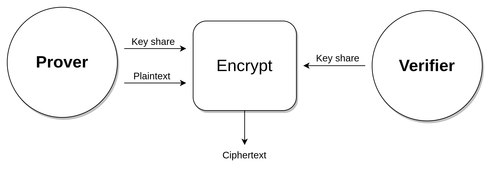
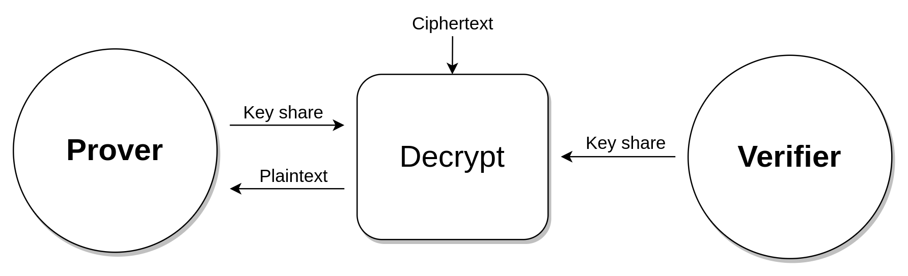

# Encryption, Decryption, and MAC Computation

This section explains how the `Prover` and `Verifier` use MPC to encrypt data sent to the server, decrypt data received from the server, and compute the MAC for the ciphertext using MPC. It shows how the `Prover` and `Verifier` collaborate to encrypt and decrypt data. The `Verifier` performs these tasks "blindly", without acquiring knowledge of the plaintext.

## Encryption

To encrypt the plaintext, both parties input their TLS key shares as private inputs to the [MPC](/mpc/deap.md) protocol, along with some other public data. Additionally, the `Prover` inputs her plaintext as a private input.

Both parties see the resulting ciphertext and execute the [2PC MAC](../../mpc/mac.md) protocol to compute the MAC for the ciphertext.

The `Prover` then dispatches the ciphertext and the MAC to the server.

## Decryption

Once the `Prover` receives the ciphertext and its associated MAC from the server, the parties first authenticate the ciphertext by validating the MAC. They do this by running the [MPC](/mpc/mac.md) protocol to compute the authentic MAC for the ciphertext. They then verify if the authentic MAC matches the MAC received from the server.

Next, the parties decrypt the ciphertext by providing their key shares as private inputs to the [MPC](/mpc/deap.md) protocol, along with the ciphertext and some other public data.

The resulting plaintext is revealed ONLY to the `Prover`.

Please note, the actual low-level implementation details of decryption are more nuanced than what we have described here. For more information, please consult [Low-level Decryption details](/mpc/encryption.md).
