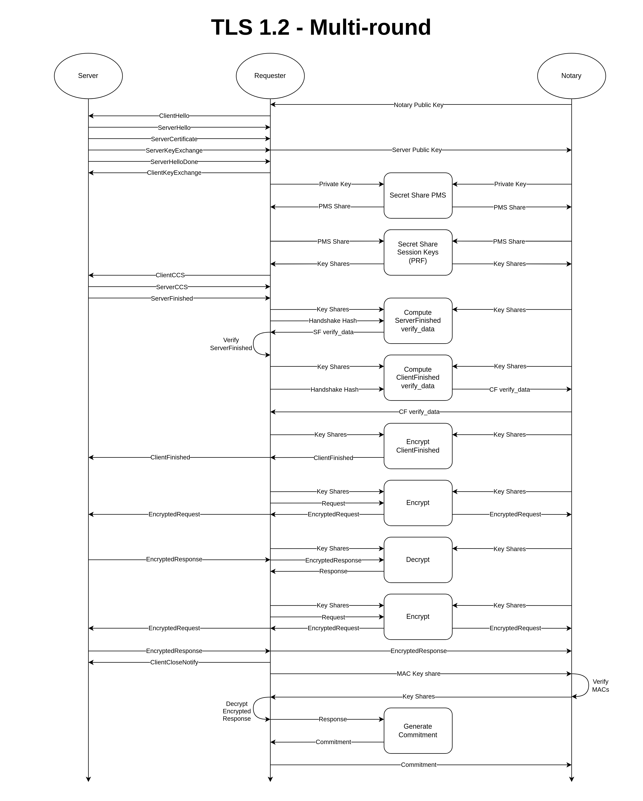

# Notarization Phase

During the Notarization Phase the `Requester`, otherwise referred to as the `User`, and the `Notary` work together to generate an authenticated `Transcript` of a TLS session with a `Server`.

Listed below are some key points regarding this process:

 - The identity of the `Server` is not revealed to the `Notary`, but the `Requester` is capable of proving the `Server` identity to a `Verifier` later.
 - The `Notary` only ever sees the *encrypted* application data of the TLS session.
 - The protocol guarantees that the `Requester` is not solely capable of constructing requests, nor can they forge responses from the `Server`.

## Requester

The `Requester` is the party which runs the TLS connection with the `Server`. The `Requester` constructs application payloads, eg. HTTP requests, and coordinates with the `Notary` to encrypt them with the TLS session keys prior to sending them. Subsequently, the `Requester` works with the `Notary` to decrypt responses from the `Server`. The plaintext of the application data is only ever revealed to the `Requester`.

## Notary

The `Notary` is the party of which the authenticity of the `Transcript` relies on. During the session the `Notary` withholds its' shares of the TLS keys and participates in a series of secure MPC protocols with the `Requester` to operate the TLS connection.

## Server

The `Server` can be any server which supports TLS. The TLSNotary protocol is entirely transparent to the `Server`, thus it cannot be censored nor does it have to support any additional functionality.

## Transcript

The primary artifact generated from this phase is called the `Transcript`. It contains session meta-data, handshake data, and commitments to all the requests and responses. Typically the `Transcript` is signed by the `Notary`, however that is not necessary in the case where the `Notary` will also act as the `Verifier` in the selective disclosure phase.

> Note that the server ephemeral key does not reveal the identity of the server to the `Notary`.

