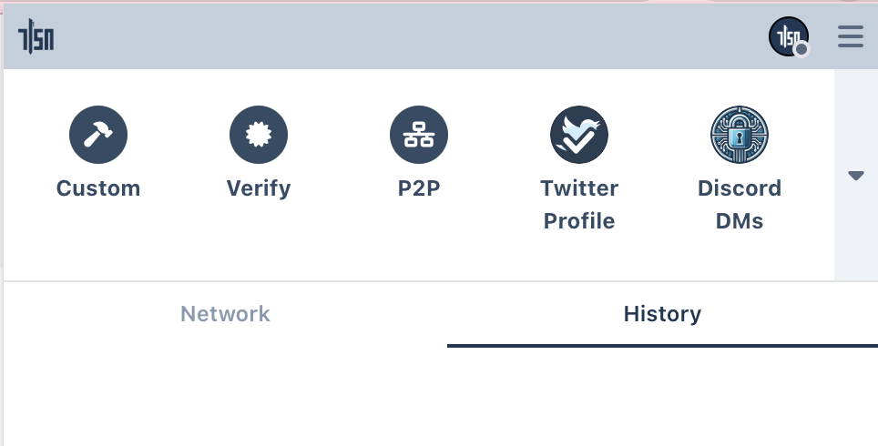
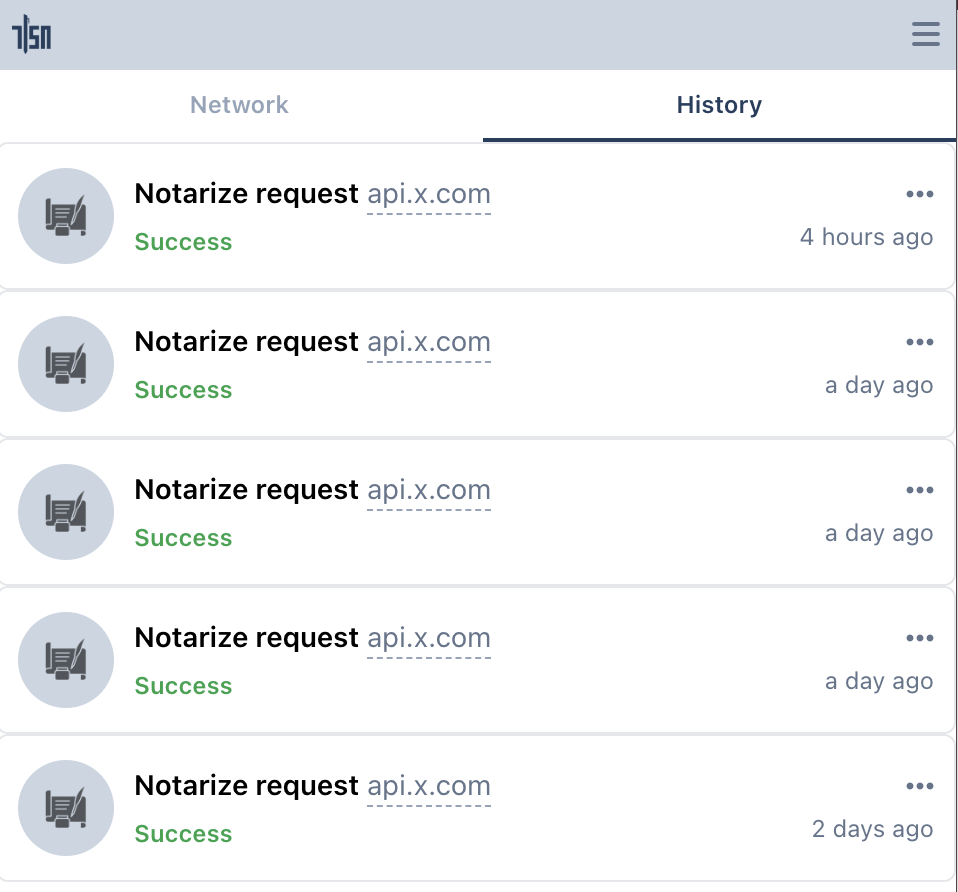

# TLSNotary Browser Extension <a name="browser"></a>

In this quick start we will prove ownership of a Twitter account with TLSNotary's browser extension.

Optionaly you can [install](#install) and configure a local [websocket proxy](#proxy) and local [notary server](#notary-server).

## Install Browser Extension (Chrome/Brave) <a name="install"></a>

The easiest way to install the TLSN browser extension is to use **[Chrome Web Store](https://chromewebstore.google.com/detail/gcfkkledipjbgdbimfpijgbkhajiaaph)**.


Alternatively, you can install it manually:
1. Download the browser extension from <https://github.com/tlsnotary/tlsn-extension/releases/download/0.1.0.800/tlsn-extension-0.1.0.800.zip>
2. Unzip  
   ⚠️ This is a flat zip file, so be careful if you unzip from the command line, this zip file contains many file at the top level
3. Open **Manage Extensions**: <chrome://extensions/>
4. Enable `Developer mode`
5. Click the **Load unpacked** button
6. Select the unzipped folder


(Optional:) Pin the extension, so that it is easier to find in the next steps:


## Websocket Proxy <a name="proxy"></a>

Since a web browser doesn't have the ability to make TCP connection, we need to use a websocket proxy server. You can either run one yourself, or use a TLSNotary hosted proxy.

To use the TLSnotary hosted proxy:
   1. Open the extension
   2. Click **Options**
   3. Enter `wss://notary.pse.dev/proxy` as **proxy API**
   4. Click **Save**

To run your own websocket proxy **locally**, run:
1. Install [wstcp](https://github.com/sile/wstcp):
```shell
cargo install wstcp
```
2. Run a websocket proxy for `https://api.x.com`:
```shell
wstcp --bind-addr 127.0.0.1:55688 api.x.com:443
```
Note the `api.x.com:443` argument on the last line.

Next use  `ws://localhost:55688` as **proxy API** in Step 3 above.

## Notary Server <a name="notary-server"></a>

To create a TLSNotary proof, the browser extension needs a TLSNotary notary server. In a real world scenario, this server should be run by a neutral party, or by the verifier of the proofs. In this quick start, you can either run the server yourself or use the test server from the TLSNotary team. Notarizing TLS with Multi Party Computation involves a lot of communication between the extension and notary server, so running a local server is the fastest option. 

To use the TLSNotary team notary server:
1. Open the extension
2. Click **Options**
3. Update Notary API to: `https://notary.pse.dev/v0.1.0-alpha.8` (Please see the list of [supported domains](#team-proxy-domains) below. Not all domains are supported on the team server.)
5. Click **Save**
6. Skip the next section and [continue with the notarization step](#notarize)

If you plan to run a local notary server:
1. Open the extension
2. Click **Options**
3. Update Notary API to: `http://localhost:7047`
4. Click **Save**
5. Run a local notary server (see [below](#local-notary))


#### TLSNotary team notary server supported domains <a name="team-proxy-domains"></a>
This is a list of the domains that can be proxied by the TLSNotary team notary server. Attempting to notarize other domains will fail silently.
```
accounts.coinbase.com:  accounts.coinbase.com:443
api.reddit.com: api.reddit.com:443
api.twitter.com: api.twitter.com:443
api.x.com: api.x.com:443
coinbase.com:  coinbase.com:444
connect.garmin.com:  connect.garmin.com:443
discord.com: discord.com:443
discord.gg: discord.gg:443
ethereum.org: ethereum.org:443
example.com: example.com:443
gateway.reddit.com: gateway.reddit.com:443
m.uber.com: m.uber.com:443
reddit.com: reddit.com:443
riders.uber.com:  riders.uber.com:443
swapi.dev: swapi.dev:443
swapi.info: swapi.info:443
tlsnotary.org: tlsnotary.org:443
twitter.com: twitter.com:443
uber.com:  uber.com:443
wise.com:  wise.com:443
www.agoda.com:  www.agoda.com:443
www.duolingo.com: www.duolingo.com:443
x.com: x.com:443
```

### Run a Local Notary Server <a name="local-notary"></a>

1. Clone the TLSNotary repository (defaults to the `main` branch, which points to the latest release):
   ```shell
      git clone https://github.com/tlsnotary/tlsn.git
   ```
2. Run the notary server:
   ```sh
   cd crates/notary/server
   cargo run --release -- --tls-enabled false
   ```

The notary server will now be running in the background waiting for connections.

## Notarize Twitter Account Access <a name="notarize"></a>

1. Open the extension, you should see the Twitter plugin:  
   
2. Click the Twitter Plugin
3. The TLSNotary Extension sidebar should open and the browser will automatically navigate to Twitter
4. If you  haven't already, log in
5. The sidebar should automatically proceeds through the steps

Tip: If you use the hosted notary server, notarization will take multiple seconds. You can track progress by opening the *offscreen console*:
* Open: <chrome://extensions> ▸ **TLSN Extension** ▸ **Details** ▸ **offscreen.html**

## Verify

When the notarization is ready, you can click the **View** button. If you closed the sidebar, you can find the proof by clicking the extension button and selecting the notarization request in the **History** tab.  
  

<!-- TODO -->
<!-- You also have the option to download the proof. You can view this proof later by using the **Verify** button or via <https://explorer.tlsnotary.org/>. You can get the Notary public key by visiting the Notary API specified [above](#notary-server). -->


## Write your own Extension Plugins

The TLSNotary Browser extension allows you to add custom plugins for more data sources. The repository at <https://github.com/tlsnotary/tlsn-plugin-boilerplate> shows how the Twitter plugin (see above) is built. The `examples` folder contains more examples.
