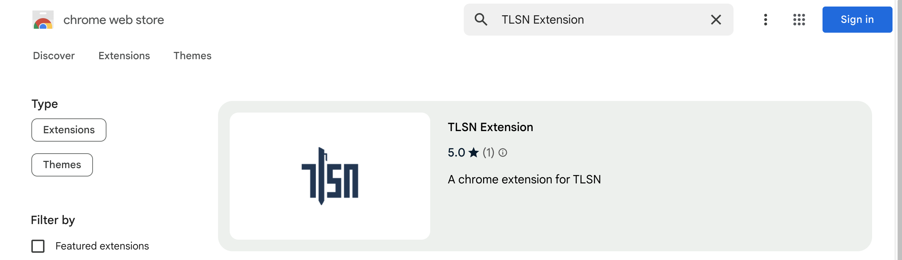
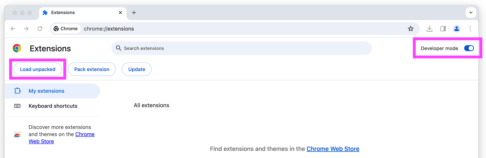
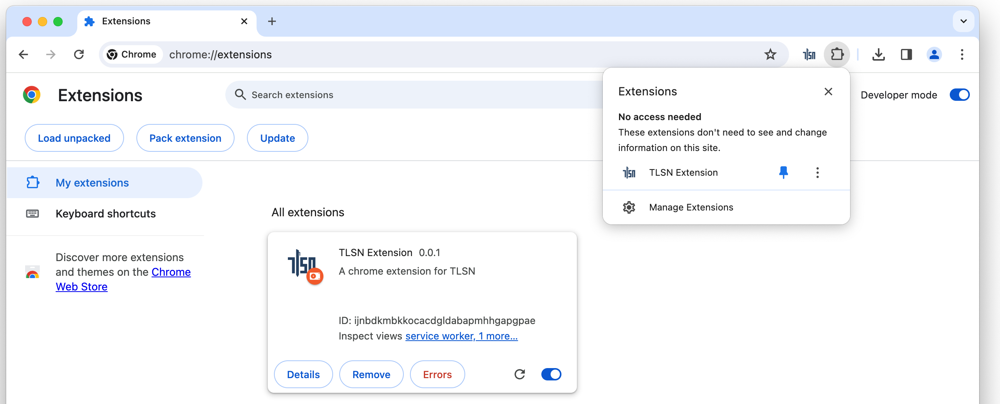
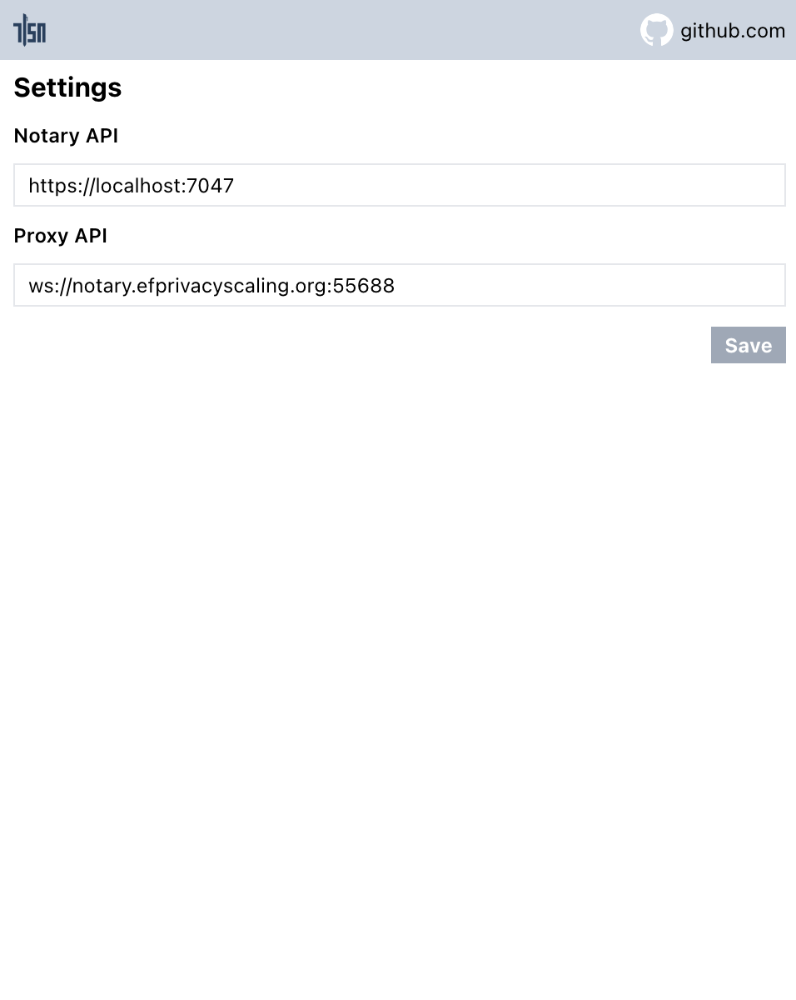
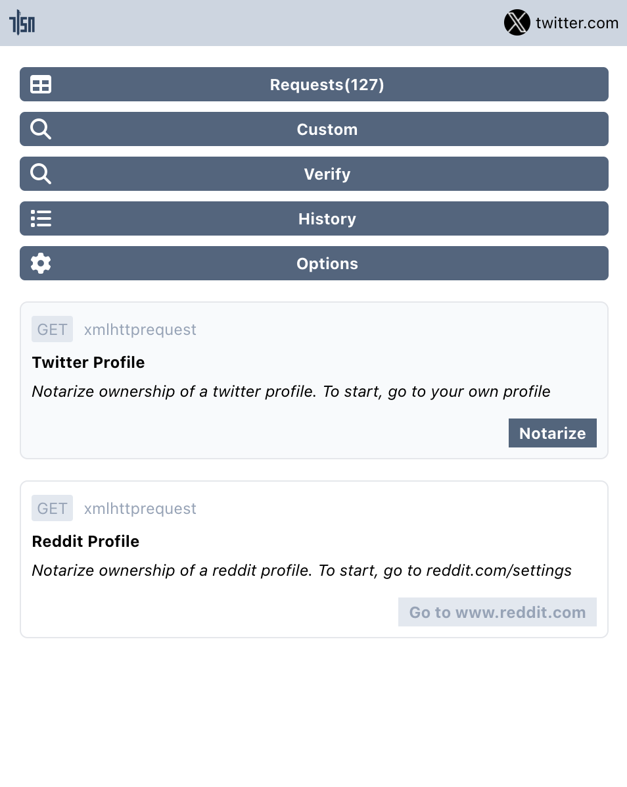
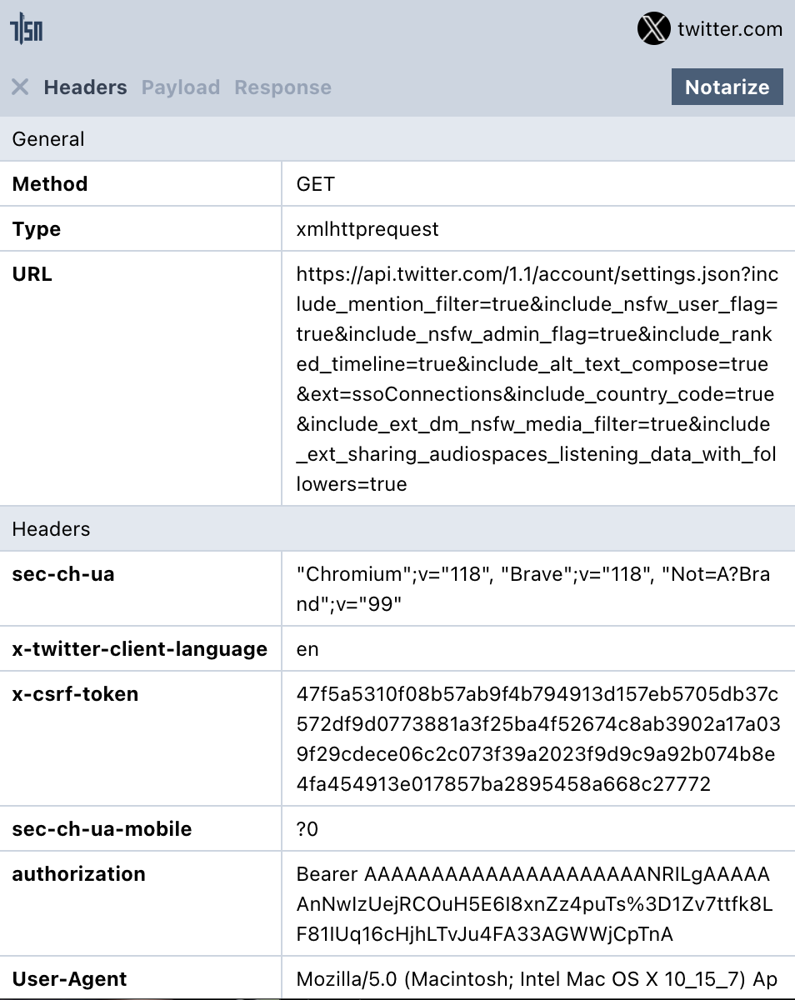
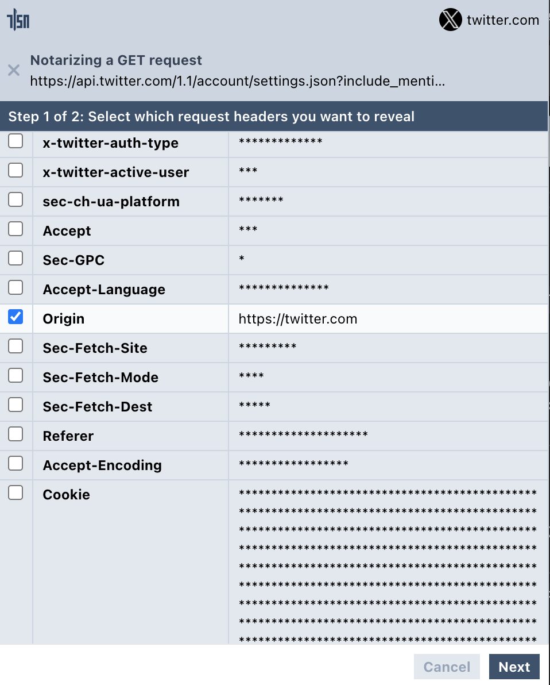
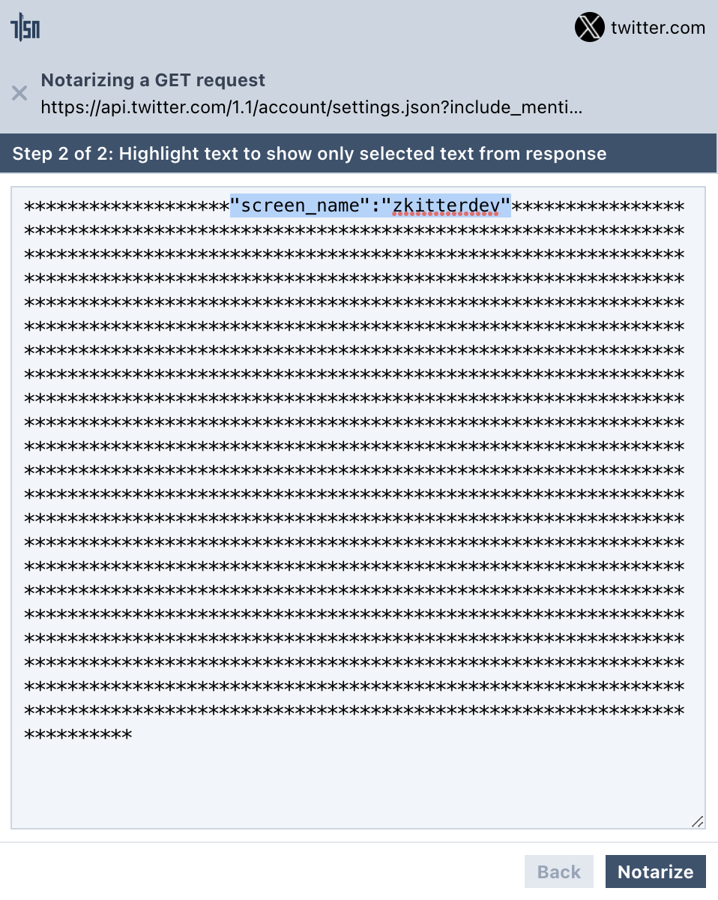
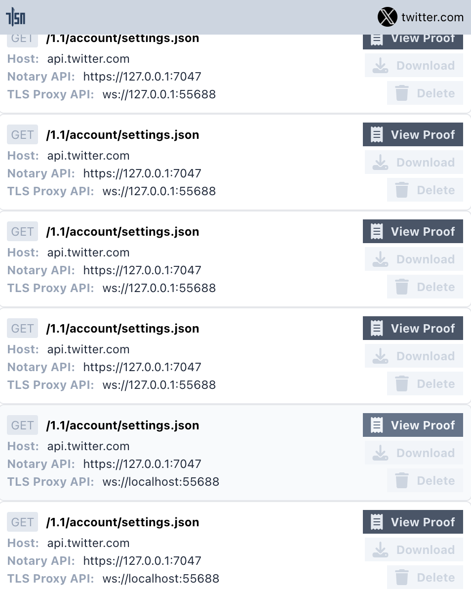
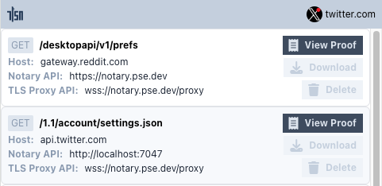

# TLSNotary Browser Extension <a name="browser"></a>

In this Quick Start we will prove ownership of a Twitter account with TLSNotary's browser extension.
First we need to [install](#install) and configure a [websocket proxy](#proxy) and a [notary server](#notary-server).

## Install Browser Extension (Chrome/Brave) <a name="install"></a>

The easiest way to install the TLSN browser extension is to use **[Chrome Web Store](https://chromewebstore.google.com/detail/gcfkkledipjbgdbimfpijgbkhajiaaph)**.



Alternatively, you can install it manually:
1. Download the browser extension from <https://github.com/tlsnotary/tlsn-extension/releases/download/0.1.0.6/tlsn-extension-0.1.0.6.zip>
2. Unzip  
   ⚠️ This is a flat zip file, so be careful if you unzip from the command line, this zip file contains many file at the top level
3. Open **Manage Extensions**: <chrome://extensions/>
4. Enable `Developer mode`
5. Click the **Load unpacked** button
6. Select the unzipped folder



(Optional:) Pin the extension, so that it is easier to find in the next steps:



## Websocket Proxy <a name="proxy"></a>

Since a web browser doesn't have the ability to make TCP connection, we need to use a websocket proxy server. You can either run one yourself, or use a TLSNotary hosted proxy.

To use the TLSnotary hosted proxy:
   1. Open the extension
   2. Click **Options**
   3. Enter `wss://notary.pse.dev/proxy` as **proxy API**
   4. Click **Save**

To run your own websockify proxy **locally**, run:
```sh
git clone https://github.com/novnc/websockify && cd websockify
./docker/build.sh
docker run -it --rm -p 55688:80 novnc/websockify 80 api.x.com:443
```
Note the `api.x.com:443` argument on the last line.

Next use  `ws://localhost:55688` as **proxy API** in Step 3 above.

## Notary Server <a name="notary-server"></a>

To create a TLSNotary proof, the browser extension needs a TLSNotary notary server. In a real world scenario, this server should be run by a neutral party, or by the verifier of the proofs. In this quick start, you can either run the server yourself or use the test server from the TLSNotary team. Notarizing TLS with Multi Party Computation involves a lot of communication between the extension and notary server, so running a local server is the fastest option. 

To use the TLSNotary team notary server:
1. Open the extension
2. Click **Options**
3. Update Notary API to: `https://notary.pse.dev/v0.1.0-alpha.6`
4. Click **Save**
5. Skip the next section and [continue with the notarization step](#notarize)

If you plan to run a local notary server:
1. Open the extension
2. Click **Options**
3. Update Notary API to: `http://localhost:7047`
4. Click **Save**
5. Run a local notary server (see [below](#local-notary))



### Run a Local Notary Server <a name="local-notary"></a>

1. Clone the TLSNotary repository  (defaults to the `main` branch, which points to the latest release):
   ```shell
      git clone https://github.com/tlsnotary/tlsn.git
   ```
2. Edit the notary server config file (`notary/server/config/config.yaml`) to turn off TLS so that the browser extension can connect to the local notary server without requiring extra steps to accept self-signed certificates in the browser (⚠️ this is only for local development purposes — TLS must be used in production).
   ```yaml
    tls:
        enabled: false
        ...
   ```
3. Run the notary server:
   ```shell
   cd notary/server
   cargo run --release
   ```

The notary server will now be running in the background waiting for connections.


## Notarize Twitter Account Access <a name="notarize"></a>

1. Open Twitter <https://twitter.com> and login if you haven't yet.
2. Open the extension, you should see requests being recorded:  
   
3. Click on **Requests** 
4. Enter the text `setting` in search box  
  
5. Select the `GET xmlhttprequest /1.1/account/settings.json` request, and then click on **Notarize**  
  
6. Select any headers that you would like to reveal.  
  
7. Highlight the text that you want to make public to hide everything else.
  
* Click **Notarize**, you should see your notarization being processed:
  

If you use the hosted notary server, notarization will take multiple seconds. You can track progress by opening the *offscreen console*:
* Open: <chrome://extensions> ▸ **TLSN Extension** ▸ **Details** ▸ **offscreen.html**


## Verify

When the notarization is ready, you can click **View Proof**. If you did close the UI, you can find the proof by clicking **History** and **View Proof**.  
  

You also have the option to download the proof. You can view this proof later by using the **Verify** button or via <https://explorer.tlsnotary.org/>. You can get the Notary public key by visiting the Notary API specified [above](#notary-server).

## Troubleshooting

* `Requests(0): no requests in the Browser extension` ➡ restart the TLSN browser extension in <chrome://extensions/> and reload the Twitter page.
* Are you using a local notary server? ➡ Check notary server's console log.
