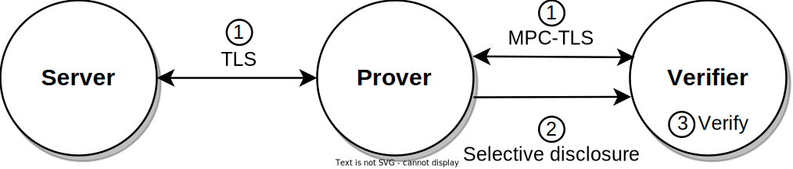
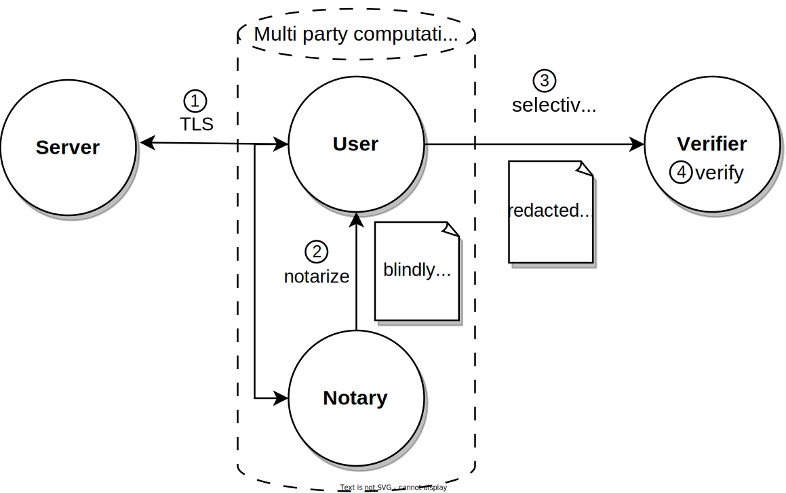

# Rust Quick Start

This Quick Start demonstrates the simplest possible use case for TLSNotary. A Prover notarizes data from a local test server with a local Notary.

## Requirements

Before we start, make sure you have cloned the `tlsn` repository and have a recent version of Rust installed.

1. Clone the `tlsn` repository (defaults to the `main` branch, which points to the latest release):
    ```shell
    git clone https://github.com/tlsnotary/tlsn.git
    ```
2. If you don't have Rust installed yet, you can install it using [rustup](https://rustup.rs/). If your Rust version is outdated, update it with `rustup update stable`.

## Simple Interactive Verifier: Verifying Data from an API in Rust<a name="interactive"></a>



Follow the instructions from:
<https://github.com/tlsnotary/tlsn/tree/main/crates/examples/interactive#readme>

## Simple Attestation Example: Verifying Data from an API in Rust with a notary<a name="attestation"></a>



Follow the instructions from:
<https://github.com/tlsnotary/tlsn/tree/main/crates/examples/attestation#readme>


🍾 Great job! You have successfully used TLSNotary in Rust.