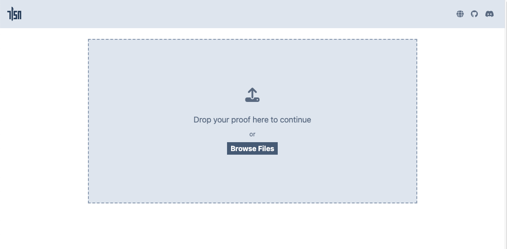
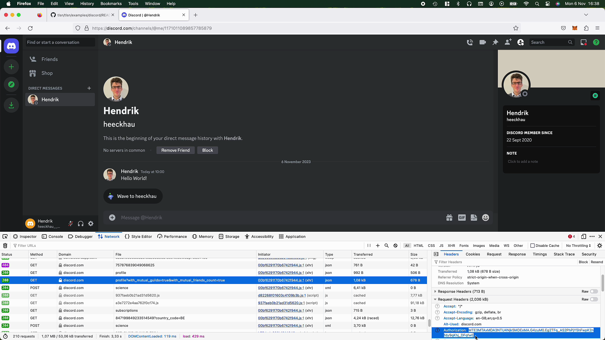

# Rust Quick Start

This Quick Start will show you how to use TLSNotary in a native Rust application.

## Requirements

Before we start, make sure you have cloned the `tlsn` repository and have a recent version of Rust installed.

###  Clone the TLSNotary Repository

Clone the `tlsn` repository (defaults to the `main` branch, which points to the latest release):

```shell
git clone https://github.com/tlsnotary/tlsn.git"
```

Next open the `tlsn` folder in your favorite IDE.

### Install Rust

If you don't have Rust installed yet, you can install it using [rustup](https://rustup.rs/):

```shell
curl --proto '=https' --tlsv1.2 -sSf https://sh.rustup.rs | sh
```

To configure your current shell, run:
```shell
source "$HOME/.cargo/env"
```

## Simple Example: Notarizing Public Data from example.com <a name="rust-simple"></a>

We will start with the simplest possible use case for TLSNotary:
1. Notarize: Fetch <https://example.com/> and create a proof of its content.
2. Verify the proof.
3. Redact the `USER_AGENT` and titles.
4. Verify the redacted proof.

### 1. Notarize <https://example.com/>

Run a simple prover:

```shell
cd tlsn/examples/simple
cargo run --release --example simple_prover
```

If the notarization was successful, you should see this output in the console:

```log
Starting an MPC TLS connection with the server
Got a response from the server
Notarization completed successfully!
The proof has been written to `simple_proof.json`
```

If you want to see more details, you can run the prover with extra logging:
```shell
RUST_LOG=DEBUG,uid_mux=INFO,yamux=INFO cargo run --release --example simple_prover
```

### 2. Verify the Proof

When you open `simple_proof.json` in an editor, you will see a JSON file with lots of non-human-readable byte arrays. (Note: The plaintext is included, in byte array form. ) You can verify this file and create a human-friendly output by running:

```shell
cargo run --release --example simple_verifier
```

This will output the TLS-transaction in clear text:

```log
Successfully verified that the bytes below came from a session with Dns("example.com") at 2023-11-03 08:48:20 UTC.
Note that the bytes which the Prover chose not to disclose are shown as X.

Bytes sent:
...
```

### 3. Redact Information

Open `tlsn/examples/simple/simple_prover.rs` and locate the line with:

```rust
let redact = false;
```

and change it to:

```rust
let redact = true;
```

Next, if you run the `simple_prover` and `simple_verifier` again, you'll notice redacted `X`'s in the output:

```shell
cargo run --release --example simple_prover
cargo run --release --example simple_verifier
```

```log
<!doctype html>
<html>
<head>
    <title>XXXXXXXXXXXXXX</title>
...
```

You can also use <https://explorer.tlsnotary.org/> to inspect your proofs. Open <https://explorer.tlsnotary.org/> and drag and drop `simple_proof.json` from your file explorer into the drop zone. [Notary public key](https://github.com/tlsnotary/tlsn/blob/main/notary/server/fixture/notary/notary.pub)



Redacted bytes are marked with `X` characters.


### (Optional) Extra Experiments

Feel free to try these extra challenges:

- [ ] Modify the `server_name` (or any other data) in `simple_proof.json` and verify that the proof is no longer valid.
- [ ] Modify the `build_proof_with_redactions` function in `simple_prover.rs` to redact more or different data.

## Notarizing Private Information: Discord Message<a name="rust-discord"></a>

Next, we will use TLSNotary to generate a proof of private information: a private Discord DM.

We will also use an explicit (locally hosted) notary server this time.

### 1. Start a Local Notary Server

The notary server used in this example is more functional compared to the (implicit) simple notary service used in the example above. This notary server should actually be run by the Verifier or a neutral party. To make things simple, we run everything on the same machine.

1. Edit the notary server config file (`notary/server/config/config.yaml`) to turn off TLS so that the rust prover can connect to the local notary server without requiring extra steps to whitelist self-signed certificates in the code.
   ```yaml
    tls:
        enabled: false
        ...
   ```
2. Run the notary server:
    ```shell
    cd notary/server
    cargo run --release
    ```

The notary server will now be running in the background waiting for connections.

Keep it running and open a new terminal.

### 2. Get Authorization Token and Channel ID

Before we can notarize a Discord message, we need some parameters in a `.env` file.

In the `tlsn/examples/discord` folder, copy the `.env.example` file and name it `.env`.

In this `.env`, we will input the `USER_AGENT`, `AUTHORIZATION` token, and `CHANNEL_ID`.

| Name          | Example                                                                            | Location                                    |
| ------------- | ---------------------------------------------------------------------------------- | ------------------------------------------- |
| USER_AGENT    | `"Mozilla/5.0 (X11; Ubuntu; Linux x86_64; rv:109.0) Gecko/20100101 Firefox/116.0"` | Look for `User-Agent` in request headers    |
| AUTHORIZATION | `"MTE1NDe1Otg4N6NxNjczOTM2OA.GYbUBf.aDtcMUKDOmg6C2kxxFtlFSN1pgdMMBtpHgBBEs"`       | Look for `Authorization` in request headers |
| CHANNEL_ID    | `"1154750485639745567"`                                                            | URL                                         |

You can obtain these parameters by opening [Discord](https://discord.com/channels/@me) in your browser and accessing the message history you want to notarize.

> **_NOTE:_** ⚠️ Please note that notarizing only works for short transcripts at the moment, so choose a contact with a short history.

Next, open the **Developer Tools**, go to the **Network** tab, and refresh the page. Then, click on **Search** and type `/api` to filter results to Discord API requests. From there, you can copy the needed information into your `.env` as indicated above.

You can find the `CHANNEL_ID` directly in the URL:

`https://discord.com/channels/@me/{CHANNEL_ID)`



### 3. Create the proof

Next, run the `discord_dm` example to generate a proof:

```shell
cd tlsn/tlsn/examples/discord
RUST_LOG=debug,uid_mux=INFO,yamux=info cargo run --release --example discord_dm
```

If everything goes well, you should see this output:

```log
...
2023-11-03T15:53:51.147732Z DEBUG discord_dm: Notarization complete!
```

The Notary server should log:

```log
2023-11-03T15:53:46.540247Z DEBUG                 main ThreadId(01) run_server: notary_server::server: Received a prover's TCP connection prover_address=127.0.0.1:56631
...
2023-11-03T15:53:46.542261Z DEBUG tokio-runtime-worker ThreadId(10) notary_server::service: Starting notarization... session_id="006b3293-8fba-44ac-8692-41daa47e4a9a"
...
2023-11-03T15:53:51.147074Z  INFO tokio-runtime-worker ThreadId(10) notary_server::service::tcp: Successful notarization using tcp! session_id="006b3293-8fba-44ac-8692-41daa47e4a9a"
```

If the transcript was too long, you may encounter the following error. This occurs because there is a default limit of notarization size to 20KB:

```log
thread 'tokio-runtime-worker' panicked at 'called `Result::unwrap()` on an `Err` value: IOError(Custom { kind: InvalidData, error: BackendError(DecryptionError("Other: KOSReceiverActor is not setup")) })', /Users/heeckhau/tlsnotary/tlsn/tlsn/tlsn-prover/src/lib.rs:173:50
```

The Discord example code redacts the `auth_token`, but feel free to change the redacted regions.

The proof is written to `discord_dm_proof.json`.

### Verify

Verify the proof by dropping the JSON file into <https://explorer.tlsnotary.org/> or by running:

```shell
cargo run --release --example discord_dm_verifier
```

🍾 Great job! You have successfully used TLSNotary in Rust.

### (Optional) Notarize More Private Data

If the examples above were too easy for you, try to notarize data from other websites such as:

- [ ] Amazon purchase
- [ ] Twitter DM (see <https://github.com/tlsnotary/tlsn/blob/main/tlsn/examples/twitter/README.md>)
- [ ] LinkedIn skill
- [ ] Steam accomplishment
- [ ] Garmin Connect achievement
- [ ] AirBnB score
- [ ] Tesla ownership
